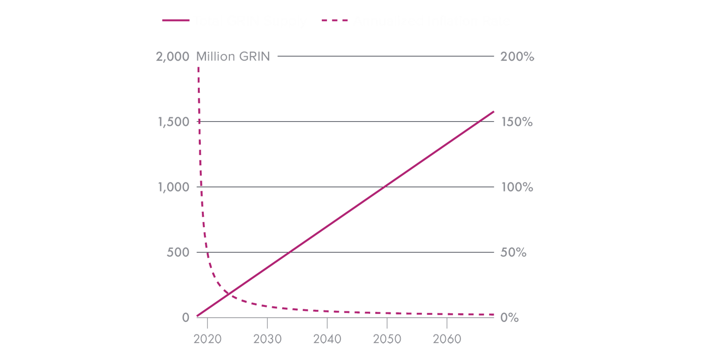

# Emission

A new grin ツ is emitted every second, forever, meaning the emission rate stays constant and completely linear. As time passes, the relative dilution becomes smaller; After 10 years, it falls below 10%. After 20, below 5%. This results in a decreasing inflation rate, known as disinflation.

{ width=650 }

This simple design serves to ensure the long-term security and stability of grin, as well as provide a fair process of distribution. We'll set to explore those topics more thoroughly.

!!! note ""
    The first four years of bitcoin's emission rate are identical to the first four of grin. Bitcoin had a full reward for 4 years, followed by half that for the following 4 years. So compared to a constant supply, after 8 years, the total amount of coins emitted is only 25% less. Compare that to daily price fluctuations.

## Security

The more resources being spent on mining a proof-of-work chain, the less it's susceptible to various mining attacks, most prominently 51% attacks. The financial resources deployed, or the overall mining revenue, are often referred to as *security spend*, which is solely determined by the incentives provided as block rewards. This reward is composed both of transactions fees, and of the block subsidy, i.e. newly generated coins.

### Block Subsidy

Grin introduces a constant block subsidy in order to remain sufficiently secure over the coming years and decades. Block reward is then *guaranteed*, regardless of how full the blocks are, or how much users are willing to pay in fees for faster confirmation.

Furthermore, this type of emission removes a lot of uncertainty, and avoids the shortcomings of the standard rapidly decreasing emission which has yet to be proven stable and effective on a longer time horizon.

### Fees

Most blockchains are designed to generate and distribute most of the currency supply early on, to directly benefit a few, and then increasingly rely on *transaction fees* to incentivize mining.

One apparent issue with this approach is that the overall security spend is likely to decrease as time passes, making the chain fundamentally less secure in the face of mining attacks, whether by selfish attackers or state actors. This results in a "tragedy of the commons", as individual users strive to pay a minimum amount of fees, while also depending on the security that their fees are paying for.[^1]

Even then, the stability of a chain sustaining itself through high transaction fees is questionable.[^2] It becomes potentially prone to a new set of mining attacks, all of which could be avoided given similar mining revenues earned through a block subsidy.

## Distribution

How the coin gets distributed carries significant importance. Grin was not created to quickly enrich a few early users, but to provide digital cash to all.

### Fair

The constant issuance establishes a fair coin distribution[^3], where equal opportunity is given to everyone, in any point in time. New users should not feel discouraged or disadvantaged when adopting a new form money.

In constrast, distributing a very large portion of the coins early, mostly benefits the first users but presents an unwelcoming narrative to new ones, as it assigns them a substantially smaller portion of the network's value. This in turn affects the currency's long-standing story of distribution.[^4]

### Wide

As it stands today, the ownership of bitcoin is very centralized and will likely remain so. The situation is far worse in most other cryptocurrencies.

Such concentration may give birth to a narrow group of individuals and organizations who may have an exorbitant amount of control over the market price. More importantly, they have the power to influence the project and its ecosystem more than any others, since early, disproportioned hoarding carries a good deal of centralization pressure.

A constant emission aims to support grin's intent of being at the hands of many people and being used to transact freely, as a privacy-preserving medium of exchange.

## More

Additional properties of constant emission that are worthy to consider:

* One of the pitfalls of monetary inflation in fiat currencies is governments can inflate the monetary supply on a whim. This has been used to disastrous effect throughout history. A consensus-based currency solves this issue by making the emission policy well known ahead of time, and makes it difficult if not impossible to change. Removing central authorities with arbitrary control is much more what makes bitcoin important than the arbitrary amount of its capped supply. By this definition, grin is just as much "sound money".
* 1 grin/s is very intuitive to understand.[^5] A clear emission rule is more likely to be enforced by community consensus, unlike a blurred, complex model.
* When ownership is more evenly distributed, it likely means that more participants are holding a sizable portion of the network, and thus more users are meaningfully incentivized to advance its growth & improve it.
* Early users do not profit exponentially due to a decreasing supply, but purely through increasing demand for the coin.

[^1]: [Bitcoin's Security Trilemma](https://youtu.be/zPYkL6L3VGw?t=988)
[^2]: [On the Instability of Bitcoin Without the Block Reward](https://www.cs.princeton.edu/~arvindn/publications/mining_CCS.pdf)
[^3]: [Grin and the Mythical Fair Launch](https://medium.com/@arjunblj/grin-and-the-mythical-fair-launch-395ca87a5e73)
[^4]: [The Story of Distribution](../../../wiki/extra-documents/story-of-distribution)
[^5]: [Nick Szabo on Supply Predictabilty](https://twitter.com/NickSzabo4/status/1077317105148547072)
