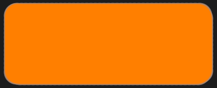
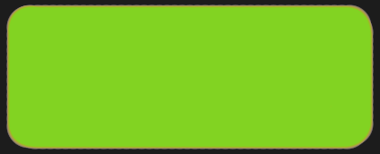
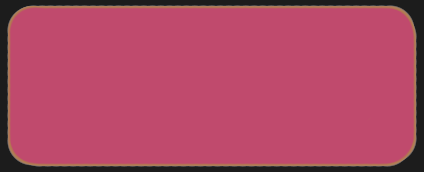
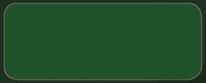
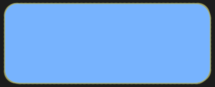

# Scalability

A Mimblewimble chain is massively-prunable, which allows it to stay lightweight and cheap to verify. Its core essence is this unique balance of privacy and scalability.

For a mimblewimble chain to be valid everything has to balance out, such that all outputs minus all inputs equals 0 (plus fees). Given that spending an output is practically just copying it to the input side of the equation, then that spent output can be completely removed from the chain and the balance still holds.

Only a small kernel has to be kept for each past transaction, forever proving it's validity. Let's illustrate with a trail of transactions:

:   *(switch between tabs)*

    === "Before"

        | Inputs     | Outputs      |            |
        | :--------: | :----------: | :--------: |
        |            | t r a n s a c t i o n |   |
        | { width=40 }   | { width=40 }            | Kernel     |
        |            | t r a n s a c t i o n |   |
        | { width=40 }          | { width=40 }            | Kernel     |
        |            | { width=40 }            |            |
        |            | t r a n s a c t i o n |   |
        | { width=40 }          | { width=40 }            | Kernel     |
        | { width=40 }   | { width=40 }            |            |
        |            | { width=40 }            |            |
        |            | t r a n s a c t i o n |   |
        | { width=40 }          | { width=40 }            | Kernel     |
        | { width=40 }          | { width=40 }            |            |

    === "Cut-through"

        | Inputs     | Outputs      |            |
        | :--------: | :----------: | :--------: |
        |            | t r a n s a c t i o n |   |
        | { width=40 }   | &#x2731; { width=40 }  &#x2731;          | Kernel     |
        |            | t r a n s a c t i o n |   |
        | &#x2731; { width=40 } &#x2731;         | &#x2731; { width=40 } &#x2731;           | Kernel     |
        |            | { width=40 }            |            |
        |            | t r a n s a c t i o n |   |
        | &#x2731; { width=40 } &#x2731;         | &#x2731; { width=40 } &#x2731;           | Kernel     |
        | { width=40 }   | &#x2731; { width=40 } &#x2731;           |            |
        |            | { width=40 }            |            |
        |            | t r a n s a c t i o n |   |
        | &#x2731; { width=40 } &#x2731;         | { width=40 }            | Kernel     |
        | &#x2731; { width=40 } &#x2731;         | { width=40 }            |            |

    === "After"

        | Inputs     | Outputs      |            |
        | :--------: | :----------: | :--------: |
        |            | t r a n s a c t i o n |   |
        | { width=40 }   |             | Kernel     |
        |            | t r a n s a c t i o n |   |
        |            |              | Kernel     |
        |            | { width=40 }            |            |
        |            | t r a n s a c t i o n |   |
        |            |             | Kernel     |
        | { width=40 }   |              |            |
        |            | { width=40 }            |            |
        |            | t r a n s a c t i o n |   |
        |            | { width=40 }            | Kernel     |
        |            | { width=40 }            |            |

An output is considered 'spent' once it is used as an input. As demonstrated above, every single input can disappear as well as every spent output. What remains is only the set of unspent outputs and all transaction kernels (~100 bytes).

In order to verify the entire history starting from the genesis block, a verifier needs:

* Block headers
* Set of unspent outputs
* Kernels

!!! info ""
    An output is a 33 bytes commitment accompanied by a 640 byte rangeproof.

Following this logic, the chain mostly grows by the number of users, instead of the number of overall transactions. In fact, it often *shrinks in size* when more inputs are used than new outputs are created.

Building, verifying and storing transactions requires minimal resources. Anyone can verify the entire chain on a phone or cheap hardware, and fully participate in areas with poor network connectivity.

**Comparison for bitcoiners**

At the time of this writing, there were 560M bitcoin transactions since its genesis. Anybody who wishes to verify the current state must replay each and every transaction in its history. They will go over billions of outputs to eventually derive the current set of 66M unspent outputs.

Mimblewimble shrinks the transaction history such that a chain with bitcoin's history would be kept at around 1/4 the size. This difference becomes much more exciting if one remembers that confidential transactions are extremely resource consuming, since each output requires a large rangeproof. If the current bitcoin blockchain had hidden amounts, it's size would have been on the order of several terabyes.
