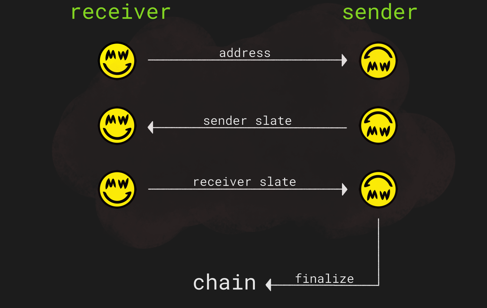

# Transactions

Mimblewimble transactions are interactive, meaning both parties need some kind of communication to interact with each other and exchange the necessary data to create a transaction.

Let's see how a standard transaction flow looks like:

{ width=650 }

The **slate** is a sheet of incomplete transaction data. Wallets transfer it back and forth until the full signature is complete.

In more detail, the process goes as follows:

1. An address, often referred to as a *Slatepack Address*, is provided by the receiver.   It is important to note; This slatepack address is only used to support peer-to-peer interaction, and is *completely different* from the familiar on-chain address, as it's not part of the ledger.   It is in fact an `ed25199` public key which serves a double role:
    * A Tor hidden service address.
    * Key to encrypt the data communicated between the sender and receiver.

1. Sender begins building the transaction slate, encrypts it with the receiver's address (a public key), and passes it over.
1. Receiver adds to the slate his own data and partial signature, and delivers it back.
1. Sender finalizes the transaction by adding the final data and his own part partial signature to the slate, thus completing the transaction building process. He can then post it to the chain.

!!! note ""
    One nice side-effect of interactive transactions is that coins can't accidentally be sent into the "void" (a public key/address which nobody controls).

## How does it happen?

The interaction between sender and receiver happens in one of two ways.

### Tor

As mentioned earlier, the slatepack address is also used to derive a Tor address. By default, the sender's wallet will try to communicate with the receiver's wallet via Tor.

If the connection succeeds, all the rest is done automatically by the two wallets and no manual action is required. The process is exactly as described above, but it all happens under the hood without further intervention.

However, if the Tor connection between the wallets is not successful for whatever reason, grin defaults to manually exchanging slate text messages, also called slatepacks. manually.

??? info "Alternative Method: http"
    Synchronous communication can also happen through regular http, but it requires opening port 3415 and thus might be complicated. We don't cover it here as this method will soon be deprecated.

### Slatepack

Recall that slates are simply partial transactions. Slatepacks are slates encoded inside compact, neatly organized and encrypted text messages.

Using this method, 2~nd~ and 3~rd~ steps, where the sender and receiver pass the slate to one another, would be done manually by exchanging these slatepack messages. To do so, almost every available communication channel will work; e-mail, forum, chat, social media, letters, pigeons etc. Creativity is the only limit.

The address (public key) initially provided by the receiver will be used to the encrypt the slatepacks, so that only the transacting parties are able to see the data inside.

!!! info "Non-encrypted Slatepacks"
    It is possible to skip the 1~st~ step (providing an address) and straight up send a non-encrypted slatepack to the receiver. Keep in mind that in this case, if the communication channel is compromised or public, observers may learn some transaction information.

## Invoice

Invoice transactions are built much the same way, but with a different order where the receiver initiates the transaction by asking for a certain amount of coins.

1. A slatepack address is provided by the sender (optional).
1. Receiver creates an invoice, requesting to be paid the specified amount. In practice he starts building the transaction slate and writes a pre-determined amount into it.
1. Sender decrypts the slate to confirm the amount he is about to pay, and adds his own data and signature.
1. Receiver finalizes the transaction building process and posts it to the chain.
