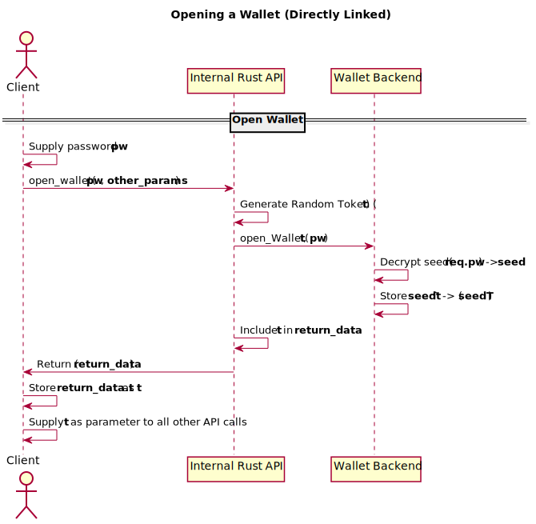
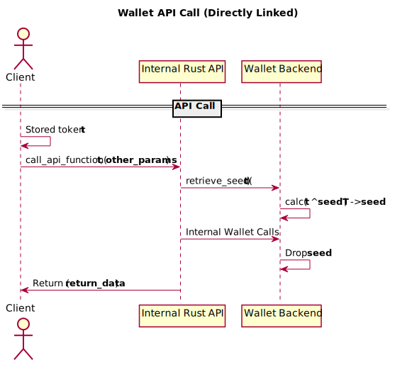

- Title: full-wallet-lifecycle
- Authors: [Michael Cordner](mailto:yeastplume@protonmail.com)
- Start date : June 26th, 2019
- RFC PR: [mimblewimble/grin-rfcs#18](https://github.com/mimblewimble/grin-rfcs/pull/18) 
- Tracking issue: [mimblewimble/grin-wallet#212](https://github.com/mimblewimble/grin-wallet/issues/212)

---

# Summary
[summary]: #summary

Increase the scope of the Grin Wallet's Owner API to support full wallet lifecycle functions.

# Motivation
[motivation]: #motivation

Grin Wallet's APIs currently provides functions for transacting and querying the contents of the wallet. However, several pieces of functionality
around wallet creation and seed/password management are not included within the API. This means that any consumers of the API will either expect their users
to initialize the wallet manually before the APIs can be used, or provide custom management for wallet lifecycle functions.

The Wallet APIs are intended to be the foundation upon which community-created wallets should be built, and the job of a wallet creator is made far
more difficult by the absence of wallet creation and seed management functions within the API. Ideally, it should be the case that a wallet can
be instantiated and managed solely via the Owner API.

# Community-level explanation
[community-level-explanation]: #community-level-explanation

From an end-user perspective, (i.e. end-users of community wallets that use the wallet API,) this change should be transparent.

# Reference-level explanation
[reference-level-explanation]: #reference-level-explanation

## Wallet Initialization

Currently, wallet data does not exist until the user runs `grin-wallet init`. The `init` command creates `grin-wallet.toml`,
in the `~/.grin/main` directory (or `~/.grin/floonet`, or the current directory via the `-h` flag), prompts the user for a password,
creates a seed file, stores the resulting data files in the directory specified in `grin-wallet.toml` (`~/.grin/main/wallet_data` by default)
and initialises the lmdb database.

It should be possible to run `grin-wallet owner_api` or invoke the API directly from a linked binary without having instantiated a wallet.

## Security Model

Given that the Wallet's Owner API needs to deal with sensitive data such as passwords and seed phrases, the API will be enhanced with a new ECDH and Token-based security model, the primary goals of which are to:

* Ensure sensitive data such as passwords or seed phrases are always end-to-end encrypted between the client and the Owner API server, regardless of what higher-level protocols are used during the exchange.
* Minimize the potential for damage that can be done by a third party listening on the exchange between a wallet client and its corresponding server.
* Ensure that sensitive data such as passwords or seed phrases are not resident in server-side memory any longer than they absolutely need to be.

Note that this mode of operation is primarily intended for use over the JSON-RPC API, which supports many different architectural possiblities. Clients that link libraries directly and keep all sensitive data in the same process would see less benefit from this scheme, and an alternative model which doesn't encrypt any sensitive data is provided. Further, authors of existing wallets will need time to consider and/or implement the added complexity needed on the client-side to support ECDH and encryption. It's therefore proposed that the Owner API initially provide the new "SecureAPI" mode as an optional feature, with wallet authors strongly encouraged to make use of it. Support for the "InsecureAPI" model can be maintained indefinitely for directly-linked wallets, and for the JSON-RPC API until a cut-off release at some point in the future.

Note that the "SecureAPI" mode and all lifecycle functions will be implemented in a V3 API, with the V2 API maintained for a time for backwards compatibility. The V3 API requires all JSON-RPC communication to be encrypted, with the exception of the `init_secure_api` function.

### SecureAPI Mode

SecureAPI Mode consists of an ECDH key agreement followed by the establishment of an API Token that's used to XOR encrypt the wallet seed on the server side. The negotiated ECDH shared key is used to encrypt all requests and responses between the client and the JSON-RPC layer, while the token must be included in all API requests to allow the wallet backend to decrypt the seed. 'Open' wallets store their in-memory seeds XORed against the token, which is temporarily XORed against the supplied token during each request to reproduce the master seed.

ECDH will use secp256k1 for key agreement.

Encryption of JSON-RPC requests and responses will be performed using AEAD in GCM mode with 128-bit tags, 96 bit nonces, a 16 byte suffix length and an empty vector for the additional data. A 12 byte nonce will be applied in the encryption and included in each request/response to use o n the decrypting side.

Encrypted requests and responses will be exchanged in valid JSON-RPC calls with the method "encrypted_request_v3" (with 'v3' here denoting the version of the API). They will have the following form:

```
{
    "jsonrpc": "2.0",
    "method: "encrypted_request_v3",
    "id": "1",
    "params": {
       "nonce": "ef32...",
       "body_enc": "e0bcd..."
    }
}
```

#### Security Mode Initialization

To initialize the Secure API, clients will generate an EC keypair using the secp256k1 curve, and provide the public key to the Owner API server via a new `init_secure_api` method. Both client and server will calculate the shared key, and store this key for the remainder of the session. The sequence of operations is outlined below:


The Secure API assumes that all requests (other than the actual call to `init_secure_api` itself) will be encrypted with the shared secret and presented in the above JSON-RPC format. All API calls other than `open_wallet` will be accompanied with a valid encrypted token derived during the call to the `open_wallet` function. This assumption will remain until the server process exits or a call to a corresponding `close_api_secure` function is called.

The shared secret can be refreshed by the client at any time with another call to `init_secure_api` (either encrypted or unencrypted). Closing a wallet via the `close_wallet` function does not regenerate the shared secret but does invalidate the token and drops the XORed seed from memory.

##### Legacy support

The V2 API will remain active for a time the mode of operation for its JSON-RPC API will be assumed to work as currently, i.e. requests and responses are unencrypted, the wallet stores its full seed in-memory between requests and the providing of a token with each request is not requred. However, the new lifecycle functions described in this RFC, which deal with highly sensitive data such as passwords and master keys, will not be available in the V2 API. This setup should allow existing wallets to continue working as-is until a cutoff release for legacy mode is determined.

#### Opening a Wallet in SecureAPI Mode

Opening a wallet in SecureAPI mode consists of encrypting a request to `open_wallet` (which contains the wallet password) with the shared secret `s`. The request is decrypted in the JSON-RPC layer and the password is used in the wallet backend to unlock the wallet master seed. The master seed is stored XORed against a randomly-generated token T, which is returned to the client in an encrypted response for inclusion in all further API calls. T is valid for the lifetime of the process, or until a corresponding call to `close_wallet`.


#### Calling API functions in SecureAPI Mode

Calls to each API function proceed as per a call to `open_wallet`, however each encrypted request must contain the token provided by the `open_wallet` call. The token is XORed against the stored XORed seed to recover the original seed by the backend for the duration of each call, and the seed value is dropped and zeroed from memory when each call returns.


### Directly Linked Wallets

Wallets that link the wallet API directly will not be required to encrypt parameters, as there would be little benefit to doing so within a single process. However, for consistency, they will be expected to store and supply a token to each API call. The modified workflow for a linked wallet is outlined below:




'Legacy' support will not be provided for directly-linked wallets on release of the features described in this RFC. It is expected that wallet authors will need to update their code to store and supply the token with each request.

## New Lifecycle API Functions

The functions as shown here are for illustrative purposes, and their signatures will change during implementation.

* `OwnerAPI::init_secure_api(pubkey: Secp256k1Point) -> Result<pubkey: Secp256K1Point, Error>`
    - Initializes secure API mode, returning the server-side public key to be used for key agreement
    - All further calls to the JSON-RPC API must be encrypted with the shared secret
* `OwnerAPI::set_wallet_directory(dir: String) -> Result<(), libwallet::Error>`
    - On API startup, it's assumed the top-level wallet data directory is `~/.grin/main/wallet_data` (or floonet equivalent)
    - Set the top-level system wallet directory from which named wallets are read. Further calls to lifecycle functions will use this wallet directory
* `OwnerAPI::create_config(chain_type: &global::ChainTypes, config_overrides: Option<GlobalWalletConfig>) -> Result<(), libwallet::Error>`
    - Outputs a `grin-wallet.toml` file into current top-level system wallet directory
    - Optionally takes wallet configuration structure to override defaults in the grin-wallet.toml file
* `OwnerAPI::create_wallet(name: Option<String>, mnemonic: Option<ZeroingString>, mnemonic_length: usize, password: ZeroingString) -> Result<(), libwallet::Error>`
    - Creates and initializes a new wallet
    - Initializes seed from given mnemonic if given, random seed otherwise
    - Should error appropriately if the wallet already exists
    - The 'name' parameter is included for future use as in `open_wallet` above.
* `OwnerAPI::open_wallet(name: Option<String>, password: String) -> Result<t:Token, libwallet::Error>`
    - Opens a wallet and sets it as the 'active' wallet. All further API commands will be performed against this wallet.
    - 'Opens' the wallet seed in memory, stored XORed against a new token. The token is to be returned to the client for use in all further API calls.
    - The 'name' argument is included for future use, anticipating the inclusion of multiple wallets and seeds within a single top-level wallet directory.
* `OwnerAPI::close_wallet(&mut self) -> Result<(), libwallet::Error>`
    - Closes the currently open wallet (i.e. drops the XORed seed from memory)
* `OwnerAPI::get_mnemonic(t:Token) -> Result<ZeroingString, libwallet::Error>`
    - Returns the mnemonic from the active, (open) wallet
* `OwnerAPI::change_password(old: ZeroingString, new: ZeroingString) -> Result<(), libwallet::Error>`
    - Changes the password for the open wallet. This will essentially:
        - Close the wallet instance
        - Confirm the existing seed can be opened with the given password
        - Regenerate the `wallet.seed` file with the new password
        - Re-open the wallet instance
        - (Should this just operate on closed wallets instead?)
* `OwnerAPI::delete_wallet(name: Option<String>, password: ZeroingString) -> Result<(), libwallet::Error>`
    - Dangerous function that removes all wallet data
    - name argument reserved for future use

### API only

Note that this RFC does not propose making user-facing changes to the existing CLI wallet to invoke these functions. It's expected that the existing cli functionality will be modified to invoke the new API functions.

### Implementation notes

Although this document doesn't attempt to outline implementation, a few notes to consider for the implementor:

* Currently, the code that deals with wallet initialization and seed management sits outside the wallet APIs, in the `impls` crate, (denoting they're implementation specific). The implementation should attempt to refactor traits from these hard implementations into a new interface, similar to the existing WalletBackend and NodeClient interfaces (WalletLifecycleManager, for instance). The implementation within `impls` will then become an implementation of that trait and can be substituted by wallet authors with their own implementations.
* The implementation period of this RFC may be a good time to remove the BIP32 specific code out from Grin core into the wallet or into a separate rust crate (probably more desirable).
* New API functions should be implemented as additions, with the new features optional to ensure complete backwards compatibility

# Drawbacks
[drawbacks]: #drawbacks

* Security-critical information such as passwords and mnemonics are covered via the encryption in the above scheme, but sending slate information via the OwnerAPI has privacy concerns.

# Unresolved questions
[unresolved-questions]: #unresolved-questions

* Due to how this is likely to be implemented, the Foreign API will also have to provide a token for all wallet access. The Foreign API will need to store this token in-process, therefore negating much of the benefit of the scheme. Is there a cleverer way to deal with this?

# Future possibilities
[future-possibilities]: #future-possibilities

The changes in this RFC lead the way for:

* Support for multiple wallets in a single top-level data directory
* An alternate method of command-line invocation whereby the wallet presents its own prompt instead of using single-use commands.

# References
[references]: #references

None


