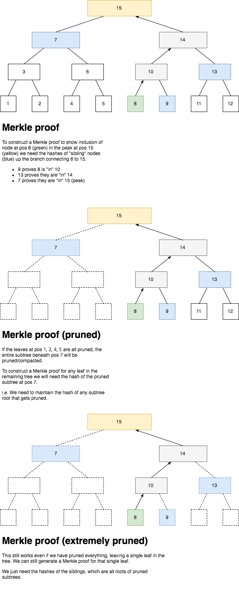

# Merkle Mountain Ranges (MMR)

> *Read this in other languages: [Korean](https://github.com/mimblewimble/grin/blob/master/doc/translations/mmr_KR.md), [简体中文](https://github.com/mimblewimble/grin/blob/master/doc/translations/mmr_ZH-CN.md).*

## Structure

!!! note ""
    For the original document describing the motivation for choosing MMR as the Merkle structure for Grin, read [here](merkle-structures(old).md).

Merkle Mountain Ranges[^1] are an alternative to Merkle trees[^2]. While the
latter relies on perfectly balanced binary trees, the former can be seen
either as list of perfectly balance binary trees or a single binary tree that
would have been truncated from the top right. A Merkle Mountain Range (MMR) is
strictly append-only: elements are added from the left to the right, adding a
parent as soon as 2 children exist, filling up the range accordingly.

Grin employs MMR to stores kernels, outputs and rangeproofs, each in its own dedicated tree.

Let's illustrates a range with 11 inserted leaves and total size 19, where each
node is annotated with its order of insertion.

```
Height

3              14
             /    \
            /      \
           /        \
          /          \
2        6            13
       /   \        /    \
1     2     5      9     12     17
     / \   / \    / \   /  \   /  \
0   0   1 3   4  7   8 10  11 15  16 18
```

This can be represented as a flat list, here storing the height of each node
at their position of insertion:

```
0  1  2  3  4  5  6  7  8  9 10 11 12 13 14 15 16 17 18
0  0  1  0  0  1  2  0  0  1  0  0  1  2  3  0  0  1  0
```

The structure can be fully described simply from its size (19). It's also
fairly simple, using fast binary operations, to navigate within a MMR.
Given a node's position `n`, we can compute its height, the position of its
parent, its siblings, etc.

## Hashing and Bagging

Just like with Merkle trees, parent nodes in a MMR have for value the hash of
their 2 children. Grin uses the Blake2b hash function throughout, and always
prepends the node's position in the MMR before hashing to avoid collisions. So
for a leaf `l` at index `n` storing data `D` (in the case of an output, the
data is its Pedersen commitment, for example), we have:

```
Node(l) = Blake2b(n | D)
```

And for any parent `p` at index `m`:

```
Node(p) = Blake2b(m | Node(left_child(p)) | Node(right_child(p)))
```

Contrarily to a Merkle tree, a MMR generally has no single root by construction
so we need a method to compute one (otherwise it would defeat the purpose of
using a hash tree). This process is called "bagging the peaks"[^1].

First, we identify the peaks of the MMR; we will define one method of doing so
here. We first write another small example MMR but with the indexes written as
binary (instead of decimal), starting from 1:

```
Height

2        111
       /     \
1     11     110       1010
     /  \    / \      /    \
0   1   10 100 101  1000  1001  1011
```

This MMR has 11 nodes and its peaks are at position 111 (7), 1010 (10) and
1011 (11). We first notice how the first leftmost peak is always going to be
the highest and always "all ones" when expressed in binary. Therefore that
peak will have a position of the form `2^n - 1` and will always be the
largest such position that is inside the MMR (its position is lesser than the
total size). We process iteratively for a MMR of size 11:

```
2^0 - 1 = 0, and 0 < 11
2^1 - 1 = 1, and 1 < 11
2^2 - 1 = 3, and 3 < 11
2^3 - 1 = 7, and 7 < 11
2^4 - 1 = 15, and 15 is not < 11
```

(This can also be calculated non-iteratively as `2^(binary logarithm of size + 1) - 1`

Therefore the first peak is 7. To find the next peak, we then need to "jump" to
its right sibling. If that node is not in the MMR (and it won't), take its left
child. If that child is not in the MMR either, keep taking its left child
until we have a node that exists in our MMR. Once we find that next peak,
keep repeating the process until we're at the last node.

All these operations are very simple. Jumping to the right sibling of a node at
height `h` is adding `2^(h+1) - 1` to its position. Taking its left child is
subtracting `2^h`.

Finally, once all the positions of the peaks are known, "bagging" the peaks
consists of hashing them iteratively from the right, using the total size of
the MMR as prefix. For a MMR of size N with 3 peaks p1, p2 and p3 we get the
final top peak:

```
P = Blake2b(N | Blake2b(N | Node(p3) | Node(p2)) | Node(p1))
```

## Pruning

In Grin, a lot of the data that gets hashed and stored in MMRs can eventually
be removed. As this happens, the presence of some leaf hashes in the
corresponding MMRs become unnecessary and their hash can be removed. When
enough leaves are removed, the presence of their parents may become unnecessary
as well. We can therefore prune a significant part of a MMR from the removal of
its leaves.

Pruning a MMR relies on a simple iterative process. `X` is first initialized as
the leaf we wish to prune.

1. Prune `X`.
1. If `X` has a sibling, stop here.
1. If 'X' has no sibling, assign the parent of `X` as `X`.

To visualize the result, starting from our first MMR example and removing leaves
[0, 3, 4, 8, 16] leads to the following pruned MMR:

```
Height

3             14
            /    \
           /      \
          /        \
         /          \
2       6            13
       /            /   \
1     2            9     12     17
       \          /     /  \   /
0       1        7     10  11 15     18
```

## Merkle Proof



!!! info ""
    In the example above, the leaf nodes are 1, 2, 4, 5, 8, 9, 11, 12. Only these nodes hash actual data, while non-leaf nodes are simply hashes of their children.

### Output Set MMR

Let's define the functionality of generating a Merkle proof for a given entry, `OutX`, in the total output set MMR.

A Merkle proof consists of the following:

* Hash of the leaf node representing `OutX`.
* Hash of the overall root of the tree.
* A list of hashes representing all the MMR peaks (they match the overall root when hashed together).
* A list of sibling hashes to construct branch from node `outX` to its peak.
* A list of sibling positions (left/right) to allow the branch to be reconstructed correctly.

A Merkle proof allows us to:

* Prove inclusion of the node beneath its peak.
* Prove the peaks combine to form the overall root hash.
* Prove inclusion of an (unspent) output for a given block_header by verifying the utxo_root matches the root of the Merkle proof
* If an output is unspent at a given block header, then it is at least as old as that block.

!!! info "Coinbase Output"
    The wallet maintains a Merkle proof (and corresponding block hash) for each unspent coinbase output.

    Spending a coinbase output requires the block hash and Merkle proof to be provided in the input. these are used to verify [coinbase maturity](../../blockchain-and-consensus/coinbase-maturity-rule/) (without requiring full block data for verification)

[^1]: [merkle-mountain-range](https://github.com/opentimestamps/opentimestamps-server/blob/master/doc/merkle-mountain-range.md), Peter Todd
[^2]: [Merkle Tree](https://en.wikipedia.org/wiki/Merkle_tree), Wikipedia
