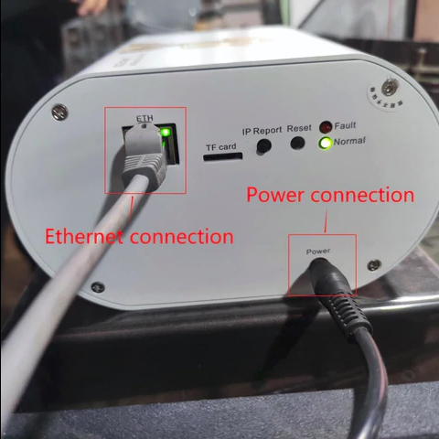
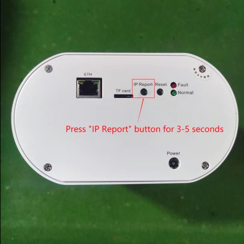
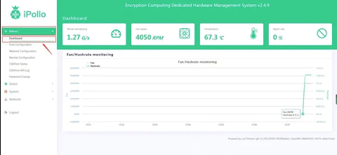

# Grin G1 Mini Setup Introductions

## Server connection

- Please connect with the Ethernet and power supply as the following shows.

Caution: The server and PC must be in the same network segment, otherwise the IP information returned by the server cannot be received.

 

## Find the server IP address.

Download the file [Showip.exe](https://gameway.fun/output/api/ipollo/download?fileName=Showip.rar).

Right click the “Show IP.exe” and run it as Administrator.

Press the “IP Report” button on the server for 3-5 seconds and release it.

The server IP address will be feedback as shown below:

 

## User Login

Enter the obtained IP address in the browser (Google Chrome is recommended) then enter the administrator account and password: admin in the server login page.

 

## Network setting

Click Miners-Network Configuration on the left side list, switch the server IP address to DHCP or Static. (Default IP address state is DHCP)

 

## Pool Setting

Click Miners-Pool Configuration on the left side list, select coin：Grin32

Available Pool for Grin32 (optional)：

Pool1：stratum+tcp://asia-east-stratum.grinmint.com:3416

Pool2：stratum+tcp://us-east-stratum.grinmint.com:3416

Pool3：stratum+tcp://grin.always.vip:3344

Pool4：stratum+tcp://grin.us.always.vip:3344

*For Decentralization and healthy Network, choose other pools please.

Pool Worker：According to the“sub-accounts”set in the corresponding mining pool account, if the sub-account is ipollo123, the worker should be ipollo123.xxx, the number suffixed used to

distinguish the server.

The default pool password is 123.

After finishing 3 pools setting, click Save&Apply.

 

## Check the operating status of server

Click Miners-Dashboard to check current server operating status.

Done!

**İnstructed by [ipollo official](https://ipollo.com/)