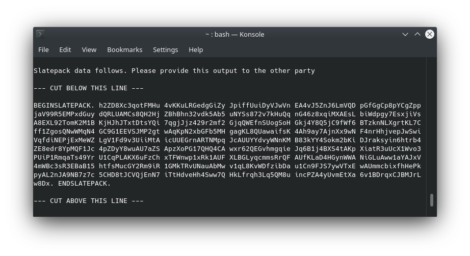
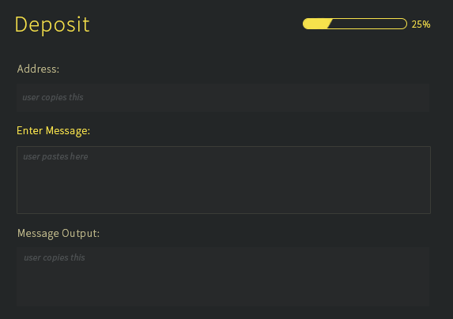

# Slatepack Integration Guide

Slatepack is a new transaction building standard for Grin designed to improve and simplify the transacting experience for all users. The full specification is available [here](https://github.com/mimblewimble/grin-rfcs/pull/55)

Slatepack was introduced in v4.0.0. Wallets and services must fully support it by v5.0.0 (Jan 2021).

## Motivation

Previously, users and exchanges had to decide between multiple transaction methods to find one that works for them. Transactions were commonly done through HTTPS, requiring users to open ports and configure firewalls, or with slate files which bring their own set of challenges. With Slatepack, a single standard needs to be supported.

## Summary

The Slatepack standard eliminates the need for HTTPS or exchanging files. Instead, it introduces two methods:

1. **Synchronous** commuication done through Tor (transaction is completed automatically similar to HTTPS).
1. **Asynchronous** communication using Slatepack Messages, which are encoded transaction strings exchanged by a simple copy-paste.

Additionally, **Slatepack Addresses** are introduced to facilitate the interaction between two wallets.

!!! done "No more endless support tickets"
    Notice how the transactions can be completed without requiring additional help from exchange support staff; When needed, wallets resort to exchanging simple string messages to complete the interaction. This should drastically reduce time spent on support tickets related to troubles around transacting with Grin.

## Overview

### Slatepack Address

A Slatepack address is a bech32 encoded address, similar to those used in Bitcoin. However, Slatepack addresses do not touch the network; they are used strictly for transaction building between two wallets, and never appear on-chain or represent ownership.

Addresses are exchanged between parties to serve as instructions for how to complete the payment. Therefore, a Slatepack address serves a double prupose:

* It decodes to a Tor address.
* Acts as a key to encrypt the transaction data being communicated by Slatepack Messages (strings).

*example address*
```text
grin1dhvv9mvarqwl6fderuxp3qgl6qppvhc9p4u24347ec0mvgg6342q4w6x56
```

!!! tip ""
    Since Slatepack addresses are bech32, they can easily be QR encoded.

### Tor (Synchronous Tx Completion)

Any Slatepack address is decoded by the wallet as a *Tor address*, where the wallet will be listening. Therefore, if both the exchange's and the user's wallets are online and connected to Tor, payments will complete automatically (the receiver's wallet needs to listen).

However, if a Tor connection between the two wallets can't be established (fails for any reason), or when a Slatepack address is not provided, the wallet will resort to exchanging Slatepack Messages for completing a transaction.

### Slatepack Messages (Asynchronous Tx Completion)

The Slatepack standard automatically handles a failed Tor connection by outputting a Slatepack Message, which is an encoded transaction string to be exchanged manually by copy-paste.

{ width=650 }

Given that the sender provides a destination address (always recommended even if Tor isn't desired), then the Slatepack Messages will be encrypted.

## Transaction Flow

As an example, let's demonstrate the workflow of an exchange.

*(switch between tabs)*

=== "Withdrawal"

    |  Step   | Exchange                 | User                        |
    | ----- | --------                | ----------                |
    |   1     |                          |  Provide Slatepack Address  |
    |   2     |  Send to Slatepack Address [(send)](https://paouky.github.io/docs/getting-started/wallet/#send)|                               |
    |   3     |  **IF TOR FAILS**: Copy message[1] |                   |
    |   4     |                    | Paste message[1]                 |
    |   5     |                    | Copy message[2]          |
    |   6     | Paste message[2] [(finalize)](https://paouky.github.io/docs/getting-started/wallet/#finalize) |

=== "Withdrawal UI"

    

=== "Deposit"

    |  Step   | Exchange                 | User                               |
    | ----- | --------                | ----------                            |
    |   1     | Provide Slatepack Address [(address)](https://paouky.github.io/docs/getting-started/wallet/#address)|                                   |
    |   2     |                    | Send to Slatepack Address                |
    |   3     |                    | **IF TOR FAILS**: Copy message[1]        |
    |   4     | Paste message[1] [(receive)](https://paouky.github.io/docs/getting-started/wallet/#receive)  |                                       |
    |   5     | Copy message[2]    |                                          |
    |   6     |                       | Paste message[2]                      |


=== "Deposit UI"

    

## Exchange Integration

Exchanges may consider several different paths for intergration:

* Exchanges may run Tor hidden services to automatically complete transactions, and also provide a user-interface for copy-pasting Slatepack Messages as a fallback mechanism.
* Some exchanges may not wish to have Tor running anywhere in their infrastructure. In this case, they may provide only the user-interface required for exchanging Slatepack Messages via copy and paste text boxes.
* Exchanges may provide unique Tor end points to serve as unique deposit addresses for each user.

### Payment proofs

Grin's lack of on-chain addresses slightly complicates proving a transaction occured. In order to solve disputes and prove funds were sent to the correct wallet, seperate [payment proofs](https://github.com/mimblewimble/grin-rfcs/blob/master/text/0006-payment-proofs.md) are used.

By default, whenever a transaction is sent to a destination Slatepack Address, a payment proof is created automatically.

The *sender* (wallet who finalized tx) can export the payment proof by specifying the tx-id (`-i`) or tx-log-id (`-t`) of a transaction, and choosing the path for the proof file, e.g:

```text
grin-wallet export_proof -i 4 "~/Documents/proof.txt"
```

He can then provide this proof to any wallet for verification. To verify:

```text
grin-wallet verify_proof /path/proof.txt
```

This will ensure that:

* The kernel for the transaction in the proof is validated and can be found on-chain.
* Both the sender and recipient's signatures correctly sign for the amount and the kernel.

Additionally, if the recipient of the transaction is the same wallet trying to verify it, then they will be informed as follows:

```text
grin-wallet verify_proof proof.txt

Payment proof's signatures are valid.
The proof's recipient address belongs to this wallet.
```


## Questions & Support

For questions about the Slatepack standard or its implementation, send a message in @grincoin#support on Keybase.

---

## Technical Details

???+ info "Technical Specification"

    ### Address

    A `SlatepackAddress` is a bech32 encoded ed25519 public key which maps to:

    * A Tor onion address `bech32 -> ed25519 -> onionv3`
    * A derivable x25519 public key for optional encryption `bech32 -> ed25519 -> x25519`

    Keys used in `SlatepackAddresses` are derived from a path from the master seed in a given wallet account. Currently the wallet uses separate derivation paths: one for the private bytes used for the blinding factor keys and one for the private bytes used to derive the ed25519 keys.

    !!! note "Unique addresses (not yet supported)"
        `SlatepackAddress` keys may be derived in parallel to the blinding factor derivation path, such that a unique address is derived for each new transaction.

    ### Message Formatting

    `WORD_LENGTH`: `15` characters

    * Number of `SimpleBase58Check` encoded characters per word; chosen for human readability across device screen sizes

    `LINE_BREAK`: `200` words

    * Number of words of `WORD_LENGTH` to include before inserting a newline; chosen for user friendliness in terminals and messaging applications

    `MAX_STRING_SIZE`: `1MB`

    * Maximum size for an armored `SlatepackMessage` string without requiring a file container
    * If a `SlatepackMessage` exceeds this value it must be handled as a `.slatepack` file instead of a string
    * This parameter chosen to cover as many cases as possible and still be supported by most clipboards

    Note that `WORD_LENGTH` and `LINE_BREAK` parameters are adjustable as a formatting convenience.

    !!! note ""
        Services and exchanges would be reasonable to support the Slatepack standard, **without** handling the rare file edge case (string >1MB).

    The `SlatepackWorkflow` establishes the steps followed to adhere to the standard:

    1. Try to establish connection via Tor

        * Derive onion address from ED25519 public key decoded from the bech32 `SlatepackAddress`
        * Attempt to complete the transaction via Tor and json-rpc as per the previous implementations
        * If connection fails, proceed to step 2
    1. Fall back to copy/paste (optionally encrypted) ascii-armored transaction strings known as `SlatepackMessage`
        * If using encryption, derive encryption key: `SlatepackAddress` -> `ed25519 public key` -> `x25519 public key`
        * Build ascii-armored string according to standard including `SimpleBase58Check`, appropriate binary encoding and framing

    1. A `SlatepackMessage` is a transaction string formatted for manual copy/paste transport. It contains the required components to build a transaction manually, similar to the transaction files previously supported but compacted for transport.
        * Example:

            ```slatepack
            BEGINSLATEPACK. 4H1qx1wHe668tFW yC2gfL8PPd8kSgv
            pcXQhyRkHbyKHZg GN75o7uWoT3dkib R2tj1fFGN2FoRLY
            GWmtgsneoXf7N4D uVWuyZSamPhfF1u AHRaYWvhF7jQvKx
            wNJAc7qmVm9JVcm NJLEw4k5BU7jY6S eb. ENDSLATEPACK.
            ```

See the [full specification](https://github.com/mimblewimble/grin-rfcs/pull/55) for complete technical details.
